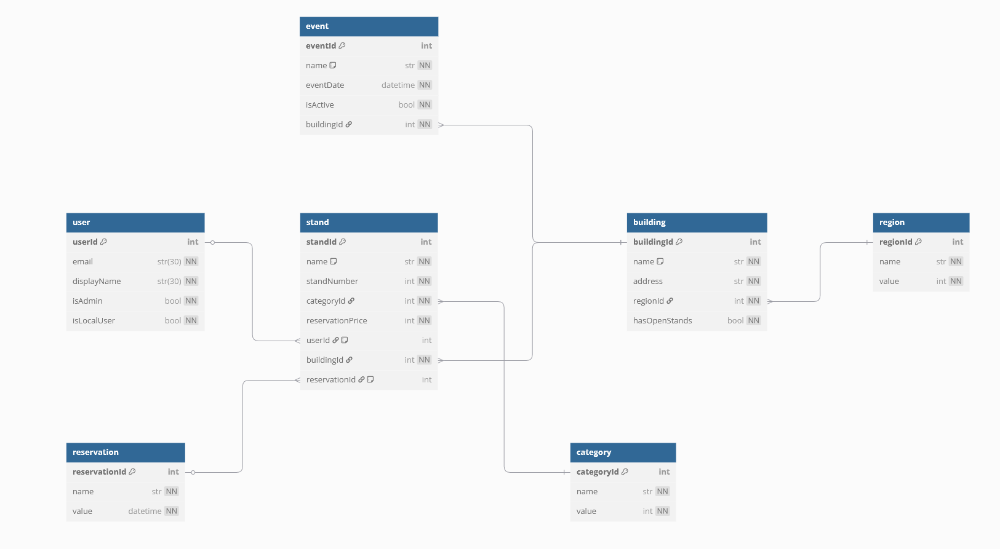

# Event Organizing Platform - Backend

This repository contains the backend for an event organizing platform built with FastAPI. It features:

- **Database Integration:** A fully fleshed-out database schema to manage events and related data.
- **Multiple Controllers:** Organized endpoints to handle various aspects of the application's functionality.
- **OAuth2 Authentication:** Secure access through your own account or google/facebook services, powered by firebase.
- **Docker and docker compose:** Makes running the project with docker and docker compose installed very easy.
- **Logging-to-file middleware**: For easy debugging

# The database model:

# API request list:

